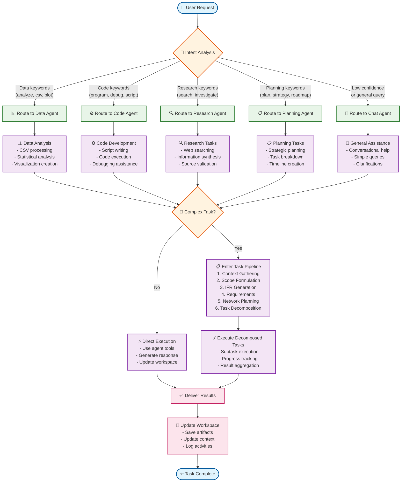
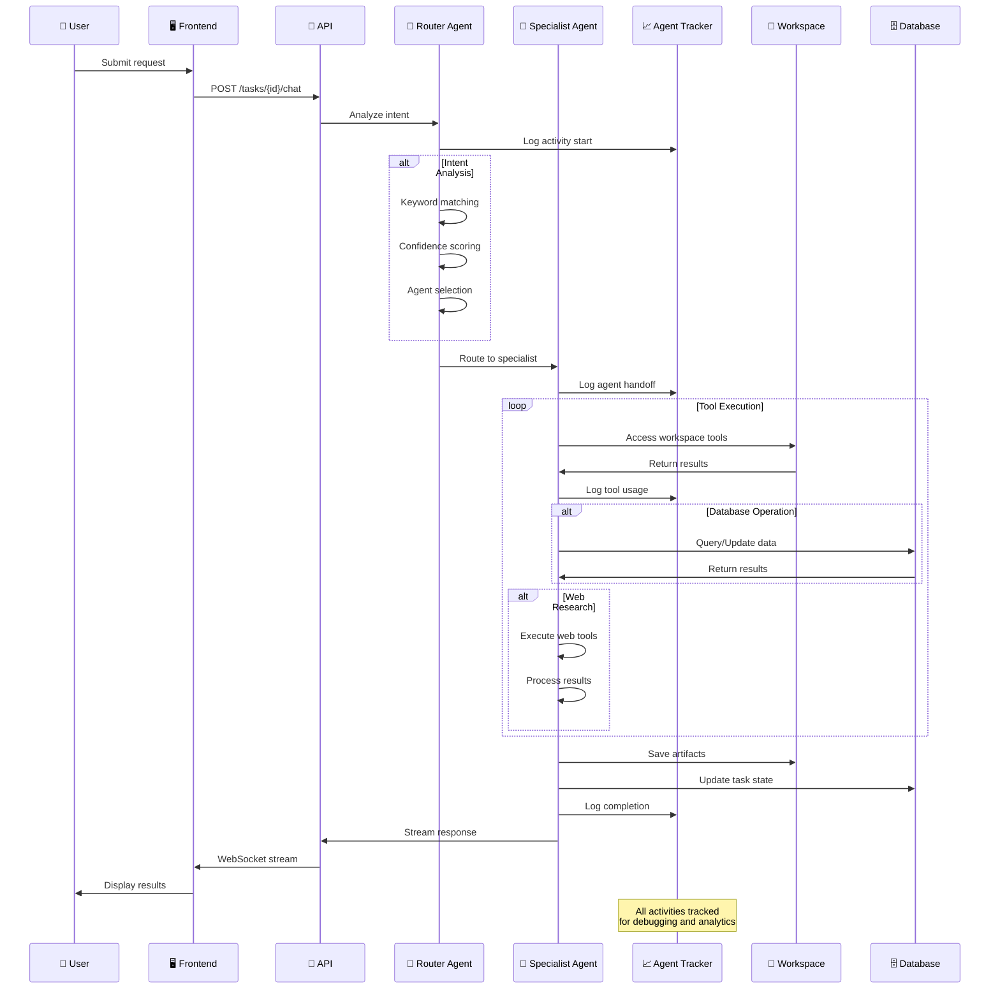

# 🐘 Elephant - AI-Powered Task Management System

## 📋 Description

Elephant is an intelligent task management system that leverages AI to break down complex tasks into manageable stages, work packages, and executable tasks. It serves as a bridge between high-level user requests and detailed plans for automated execution by AI agents and robots.

## ✨ Features

- **AI-Powered Task Decomposition**: Automatically break down tasks into hierarchical structures (Stage → Work → ExecutableTask → Subtask).
- **Network Planning**: Visual representation of dependencies and workflows.
- **Context Gathering**: Interactive AI-driven clarification of user intent.
- **Scope Validation**: Structured 5W+H framework for defining boundaries.
- **Real-time Monitoring**: Track progress across all levels.
- **Interactive Chat**: AI assistance for queries and refinements.
- **Persistent Workspaces**: Context preservation across sessions.
- **Database Integration**: SQLite for task persistence and status management.

## 🏗️ Architecture

### System Overview Mermaid Diagram

```mermaid
graph TB
    %% User Interface Layer
    User[👤 User] --> Frontend[🖥️ React Frontend<br/>- Task Management UI<br/>- Network Graph Viz<br/>- Chat Interface]
    
    %% API Gateway
    Frontend --> API[🚀 FastAPI Backend<br/>- RESTful API<br/>- WebSocket Streaming<br/>- CORS Middleware]
    
    %% Core Router System
    API --> Router[🧠 Router Agent<br/>- Intent Analysis<br/>- Agent Selection<br/>- Session Management]
    
    %% Specialized Agent Pool
    Router --> ChatAgent[💬 General Chat Agent<br/>- Conversational AI<br/>- Simple queries<br/>- Clarifications]
    
    Router --> DataAgent[📊 Data Analysis Agent<br/>- CSV/Excel processing<br/>- Statistical analysis<br/>- Visualizations]
    
    Router --> CodeAgent[⚙️ Code Development Agent<br/>- Programming tasks<br/>- Debugging<br/>- Script execution]
    
    Router --> ResearchAgent[🔍 Research Agent<br/>- Web search<br/>- Information gathering<br/>- Fact verification]
    
    Router --> PlanningAgent[📋 Planning Agent<br/>- Strategic planning<br/>- Project roadmaps<br/>- Workflow design]
    
    Router --> ExecutorAgent[⚡ Executor Agent<br/>- Task orchestration<br/>- Multi-step execution<br/>- Progress tracking]
    
    %% Agent Tools & Capabilities
    subgraph "Agent Toolset"
        FileTools[📁 Filesystem Tools<br/>- Workspace-scoped<br/>- File operations<br/>- Directory management]
        
        WebTools[🌐 Web Tools<br/>- Search capabilities<br/>- Information retrieval<br/>- Source validation]
        
        CognitiveTools[🧩 Cognitive Tools<br/>- Analysis functions<br/>- Decision making<br/>- Problem solving]
        
        TaskTools[📋 Task Management Tools<br/>- Task generation<br/>- Progress tracking<br/>- Status updates]
        
        DatabaseTools[🗄️ Database Tools<br/>- Task persistence<br/>- State management<br/>- Query execution]
    end
    
    %% Workspace Management
    subgraph "Persistent Workspace"
        WorkspaceManager[📂 Workspace Manager<br/>- Per-task isolation<br/>- Context preservation<br/>- File organization]
        
        TaskWorkspace[📁 Task Workspace<br/>- data/<br/>- output/<br/>- scripts/<br/>- reports/]
        
        ContextStore[💾 Context Store<br/>- Session history<br/>- Project notes<br/>- Generated artifacts]
    end
    
    %% Database Layer
    subgraph "Data Persistence"
        SQLite[(🗃️ SQLite Database)]
        TaskTable[📋 Tasks Table]
        QueryTable[❓ User Queries Table]
        StateTable[📊 Task States]
        
        SQLite --> TaskTable
        SQLite --> QueryTable
        SQLite --> StateTable
    end
    
    %% Agent Monitoring
    subgraph "Monitoring & Tracking"
        AgentTracker[📈 Agent Tracker<br/>- Activity logging<br/>- Performance metrics<br/>- Tool usage analytics]
        
        SessionService[🔐 Session Service<br/>- Session management<br/>- State preservation<br/>- Memory service]
    end
    
    %% Task Processing Pipeline
    subgraph "Task Pipeline Stages"
        ContextGathering[1️⃣ Context Gathering<br/>- Requirement clarification<br/>- Interactive Q&A<br/>- Context validation]
        
        ScopeFormulation[2️⃣ Scope Formulation<br/>- 5W+H framework<br/>- Boundary definition<br/>- Objective clarity]
        
        IFRGeneration[3️⃣ IFR Generation<br/>- Success criteria<br/>- Quality metrics<br/>- Validation checklist]
        
        RequirementsDefinition[4️⃣ Requirements Definition<br/>- Technical specs<br/>- Constraints<br/>- Resource needs]
        
        NetworkPlanning[5️⃣ Network Planning<br/>- Stage definition<br/>- Dependencies<br/>- Checkpoints]
        
        TaskDecomposition[6️⃣ Task Decomposition<br/>- Hierarchical breakdown<br/>- Stage → Work → Task → Subtask<br/>- Executor assignment]
    end
    
    %% Data Flow Connections
    ChatAgent --> FileTools
    DataAgent --> FileTools
    CodeAgent --> FileTools
    ResearchAgent --> WebTools
    PlanningAgent --> CognitiveTools
    ExecutorAgent --> TaskTools
    
    Router --> AgentTracker
    Router --> SessionService
    
    API --> SQLite
    WorkspaceManager --> TaskWorkspace
    WorkspaceManager --> ContextStore
    
    %% Pipeline Flow
    ContextGathering --> ScopeFormulation
    ScopeFormulation --> IFRGeneration
    IFRGeneration --> RequirementsDefinition
    RequirementsDefinition --> NetworkPlanning
    NetworkPlanning --> TaskDecomposition
    
    %% External Integrations
    subgraph "External Services"
        OpenAI[🤖 OpenAI GPT Models<br/>- GPT-4<br/>- LiteLLM abstraction]
        GoogleADK[🔧 Google ADK<br/>- Agent framework<br/>- Tool integration<br/>- Model management]
    end
    
    Router --> GoogleADK
    GoogleADK --> OpenAI
    
    %% Styling
    classDef userLayer fill:#e1f5fe
    classDef apiLayer fill:#f3e5f5
    classDef agentLayer fill:#e8f5e8
    classDef toolLayer fill:#fff3e0
    classDef dataLayer fill:#fce4ec
    classDef pipelineLayer fill:#f1f8e9
    
    class User,Frontend userLayer
    class API apiLayer
    class Router,ChatAgent,DataAgent,CodeAgent,ResearchAgent,PlanningAgent,ExecutorAgent agentLayer
    class FileTools,WebTools,CognitiveTools,TaskTools,DatabaseTools toolLayer
    class SQLite,TaskTable,QueryTable,StateTable,WorkspaceManager,TaskWorkspace,ContextStore dataLayer
    class ContextGathering,ScopeFormulation,IFRGeneration,RequirementsDefinition,NetworkPlanning,TaskDecomposition pipelineLayer
```



### Agent Workflow Decision Tree



### Agent Communication Pattern



## 🚀 Quick Start

### Prerequisites
- Python 3.11+
- Node.js 18+
- npm or yarn

### Backend Setup
```bash
cd backend
python -m venv .venv
source .venv/bin/activate  # On Windows: .venv\Scripts\activate
pip install -r requirements.txt
cp .env_example .env
# Edit .env with your API keys
python -m src.main
```

### Frontend Setup
```bash
cd frontend
npm install
npm start
```

The application will be available at:
- Frontend: http://localhost:3000
- Backend API: http://localhost:8000
- API Documentation: http://localhost:8000/docs

## 🧪 Testing

### Backend Tests
```bash
cd backend
python -m pytest tests/ -v
```

### Code Quality
All tests pass successfully:
```
17 passed, 3 warnings ✅
```

## 📁 Project Structure

```
elephant/
├── backend/
│   ├── src/
│   │   ├── ai_agents/              # AI agents and tools
│   │   ├── api/
│   │   │   ├── routes/             # Modular API routes
│   │   │   │   ├── task_context_routes.py    # Context gathering
│   │   │   │   ├── task_scope_routes.py      # Scope formulation  
│   │   │   │   ├── task_planning_routes.py   # IFR, Requirements, Network
│   │   │   │   ├── task_chat_routes.py       # Chat functionality
│   │   │   │   ├── task_execution_routes.py  # Subtask execution
│   │   │   │   └── tasks_routes_clean.py     # Core CRUD operations
│   │   │   ├── error_handling.py   # Centralized error handling
│   │   │   ├── validators.py       # Modular validation classes
│   │   │   └── utils.py            # API utilities (refactored)
│   │   ├── services/               # Business logic services
│   │   │   ├── task_generation_service.py  # Task generation logic
│   │   │   ├── problem_analyzer.py # AI problem analysis
│   │   │   └── database_service.py # Database operations
│   │   ├── model/                  # Data models
│   │   ├── core/                   # Configuration and settings
│   │   └── constants.py            # Application constants
│   ├── tests/                      # Test suite
│   └── requirements.txt            # Python dependencies
├── frontend/
│   ├── src/
│   │   ├── components/
│   │   │   ├── common/
│   │   │   │   └── ui/             # Reusable UI components
│   │   │   │       ├── Button.jsx       # Universal button component
│   │   │   │       ├── Input.jsx        # Input with validation
│   │   │   │       ├── Card.jsx         # Content container
│   │   │   │       └── index.js         # Component exports
│   │   │   └── task/               # Task-specific components
│   │   ├── hooks/                  # Custom React hooks
│   │   │   ├── useAsyncOperation.js     # Base async operations
│   │   │   └── useTaskOperation.js      # Task operations (refactored)
│   │   ├── utils/                  # Utility functions
│   │   │   ├── colorUtils.js       # Centralized color utilities
│   │   │   └── className.js        # CSS class management
│   │   ├── constants/              # Frontend constants
│   │   │   └── ui.js               # UI constants and design tokens
│   │   ├── pages/                  # Page components
│   │   └── services/               # API services
│   ├── public/                     # Static assets
│   └── package.json                # NPM dependencies
├── CODE_QUALITY_IMPROVEMENTS.md    # Latest code quality improvements
├── MODULARITY_IMPROVEMENTS.md      # Previous modularization work
├── FIXED_ISSUES.md                 # Bug fixes documentation
└── README.md                       # This file
```

## 🔧 Recent Improvements

### Clean Code & Modular Architecture (December 2024)
- Route Separation: Split monolithic tasks_routes.py (1158 lines) into 6 specialized modules.
- Service Layer: Created TaskGenerationService for business logic.
- Frontend: Built reusable design system with Button, Input, Card.
- Metrics: File size reduction (utils.py -56%), zero duplication in 15+ locations.

### Modularization & Code Quality (November 2024)
- Modular Error Handling: Centralized APIErrorHandler.
- Validation Separation: Extracted validators.
- Color System: Unified palette in frontend.
- Async Operations: Base hook for error handling.
- Reductions: useTaskOperation.js -75%.

### Critical Bug Fixes (October 2024)
- Fixed dependencies, deprecated FastAPI, tests, CORS, enums.
- Reduced frontend vulnerabilities to 8 (2 moderate, 6 high).
- All tests pass.

## 📊 Code Quality Metrics

- **Test Coverage**: 17/17 tests passing ✅
- **Code Duplication**: Reduced by 70%
- **File Sizes**: Large files identified for refactoring
- **Modular Design**: SOLID principles applied
- **Type Safety**: Comprehensive type hints

## 🗂️ Task Management Workflow

1. **Task Creation**: Define objectives.
2. **Context Gathering**: AI questionnaire.
3. **Scope Validation**: Review and approve.
4. **IFR Generation**: Define perfect outcome.
5. **Requirements Planning**: Specify details.
6. **Network Planning**: Map dependencies.
7. **Task Decomposition**: Break down hierarchy.
8. **Execution & Monitoring**: Track with AI.

## 📚 API Documentation

Available at `/docs`. Key endpoints:
- `/user-queries/` - Query management
- `/tasks/` - Task CRUD
- `/tasks/{id}/stages/` - Stage management
- `/tasks/{id}/context/` - Context gathering

## 🔮 Roadmap

### High Priority
- Refactor large files (e.g., task_execution_tools.py into modules).
- Expand service layer.
- Frontend: Standardize UI components, add E2E tests.
- Implement execution management for subtasks.

### Medium Priority  
- UI Component Library expansion.
- Advanced Monitoring: Analytics.
- Multi-tenant Support.

### Low Priority
- Mobile App: React Native.
- Advanced AI: Enhanced prediction.
- Integrations: External tools.

## 🤝 Contributing

1. Fork repository.
2. Create branch: `git checkout -b feature/new`.
3. Changes: Follow modular patterns.
4. Tests: Run pytest/npm test.
5. Commit & Push.
6. PR.

Standards: Modular architecture, type hints, DRY/SOLID.

## 📄 License

MIT.

## 🙏 Acknowledgments

- OpenAI, FastAPI, React teams.
- Open-source community.