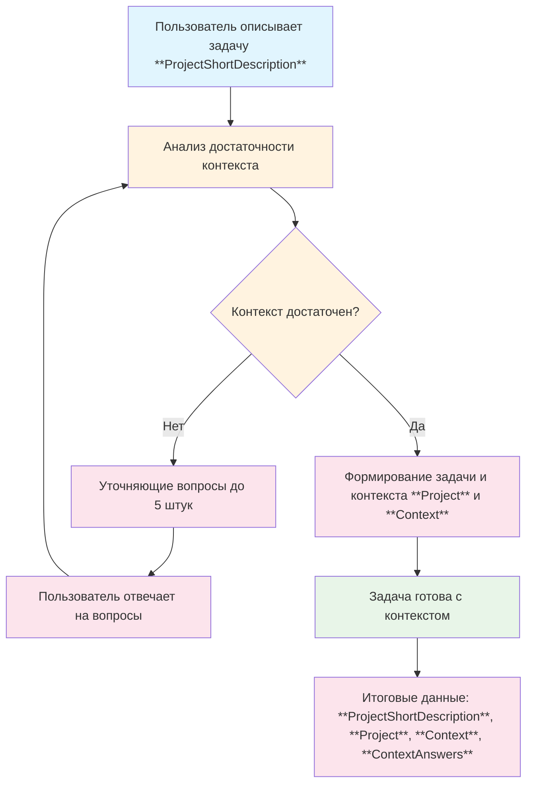

# Методология сбора контекста в Elephant

## Процесс сбора контекста

## Пошаговая инструкция

### Шаг 1: Получение описания проекта (**ProjectShortDescription**)
**Что происходит:** Пользователь описывает свой проект в свободной форме

**Что делать:**
1. Примите описание проекта от пользователя
2. Сохраните его как **ProjectShortDescription** (входные данные)
3. Не интерпретируйте и не добавляйте предположений

**Результат:** Исходное описание проекта зафиксировано

---

### Шаг 2: Анализ достаточности контекста
**Что происходит:** Система анализирует, достаточно ли информации в описании для понимания проекта

**Что проверяется:**
- Можно ли четко понять цель проекта?
- Известны ли ключевые требования?
- Понятен ли желаемый результат?
- Есть ли информация о ограничениях?

**Результат:** Решение о достаточности контекста (да/нет)

---

### Шаг 3: Генерация уточняющих вопросов (если контекст недостаточен)
**Что происходит:** Если контекста недостаточно, генерируются вопросы для уточнения

**Что делать:**
1. Сгенерировать до 5 наиболее важных вопросов
2. Вопросы должны быть конкретными и релевантными
3. Включить варианты ответов где возможно

**Результат:** Список уточняющих вопросов

---

### Шаг 4: Сбор ответов пользователя
**Что происходит:** Пользователь отвечает на сгенерированные вопросы

**Что делать:**
1. Предъявить вопросы пользователю по одному
2. Позволить выбрать из вариантов или ввести свой ответ
3. Сохранить все ответы как **ContextAnswers**

**Результат:** Ответы на все вопросы собраны

---

### Шаг 5: Повторный анализ (вернуться к шагу 2)
**Что происходит:** С новыми ответами анализ повторяется

**Что делать:**
- Вернуться к шагу 2 с расширенной информацией
- Процесс продолжается до тех пор, пока контекст не станет достаточным

---

### Шаг 6: Формирование проекта и контекста (если контекст достаточен)
**Что происходит:** На основе полного набора информации создаются структурированные **Project** и **Context**

**Что делать:**
1. Сформировать четкое описание **Project**
2. Создать комплексный **Context** с техническими деталями
3. Сохранить историю вопросов и ответов

**Результат:** Проект готов к следующему этапу

---

### Шаг 7: Завершение процесса
**Что происходит:** Проект с полным контекстом готов к следующему этапу

**Результат:** **Project** + **Context** + **ContextAnswers** готовы для использования

## Вход и выход

### Входные данные
- **ProjectShortDescription**: Краткое описание проекта пользователем в свободной форме

### Выходные данные
- **Project**: Структурированное описание проекта (1-3 предложения)
- **Context**: Комплексный контекст реализации проекта
- **ContextAnswers**: История вопросов и ответов для прозрачности

## Глоссарий ключевых терминов

| Термин | Описание |
|--------|----------|
| **ProjectShortDescription** | Исходное описание проекта от пользователя |
| **Context Sufficiency** | Оценка достаточности информации (да/нет) |
| **Project** | Четкое структурированное описание проекта |
| **Context** | Детальная информация о реализации проекта |
| **ContextAnswers** | История вопросов и ответов |

## Принципы работы

### 🎯 Принцип достаточности
Контекст считается достаточным, когда позволяет однозначно понять цель, требования и ограничения проекта.

### 🔄 Принцип эффективности
Генерируется до 5 наиболее важных вопросов за один раз вместо множественных итераций.

### 📈 Принцип адаптивности
Количество и сложность вопросов адаптируется под тип задачи (1-5 вопросов).

### 🛡️ Принцип защиты от перегрузки
Фокус на критичных аспектах, игнорирование тем "решится позже".
