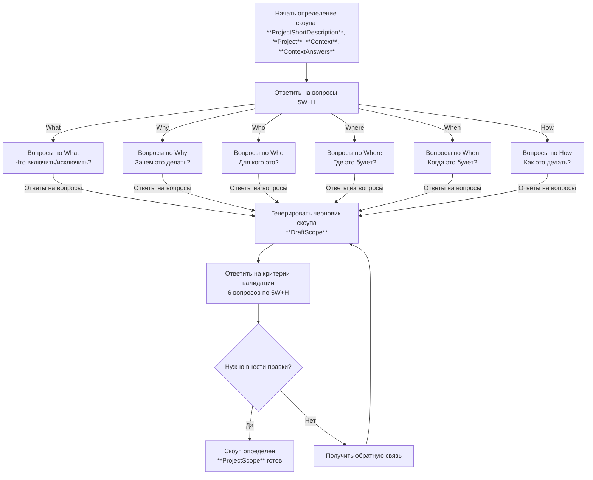

# Методология определения скоупа в Elephant

## Философия скоупа как путешествия

Проект - это путешествие из точки А (текущее состояние) в точку Б (желаемый результат). Определение скоупа - это планирование маршрута этого путешествия. 6 измерений скоупа (5W+H) описывают все аспекты пути: что мы везем, почему едем, кто с нами, где проходим, когда прибудем и как доберемся.

## Процесс определения скоупа

## Пошаговая инструкция

### Шаг 1: Начало планирования путешествия
**Что происходит:** Начинается планирование маршрута проекта как путешествия из точки А в точку Б

**Что делать:**
1. Проверить, что предыдущий этап **Context Gathering** завершен
2. Убедиться в наличии **ProjectShortDescription**, **Project**, **Context**, **ContextAnswers**
3. Инициировать планирование маршрута путешествия

**Результат:** Планирование путешествия запущено

---

### Шаг 2: Определение маршрута 5W+H
**Что происходит:** Определяются все аспекты путешествия через 6 измерений скоупа

**Измерения скоупа (5W+H) - философия каждого измерения:**

- **What (Что)**: Действие и суть проекта. Что конкретно происходит в этом проекте? Какие результаты и deliverables будут созданы? Что включено в проект, а что явно исключено? Это описание движения - что мы делаем в процессе перехода из точки А в точку Б. Какие изменения происходят, какие результаты мы получаем, что остается неизменным?

- **Why (Зачем)**: Мотивационные вопросы движения. Почему мы начинаем это путешествие? Зачем двигаться из точки А в точку Б? Какие цели, ценности и причины стоят за этим проектом? Это объяснение вектора движения - почему мы выбрали именно этот путь, что нас мотивирует, какую ценность мы создаем, какие проблемы решаем?

- **Who (Для кого)**: Участники путешествия. Для кого мы это делаем? Кто является целевой аудиторией? Кто будет использовать результаты? Кто отвечает за реализацию? Кто движется с нами в этом векторе? Это могут быть конкретные люди, роли, группы или организации - все, кто вовлечен в путешествие или затронут его результатами.

- **Where (Где)**: Расположение в большом пространстве. Где происходит это движение? На каких платформах? В каких средах? В каких локациях (физических или виртуальных)? Какие технические ограничения накладывает окружение? Это контекст пространства, в котором происходит наше путешествие - операционная среда, инфраструктура, экосистема.

- **When (Когда)**: Временные рамки движения. Когда начинается путешествие? Когда должны быть достигнуты ключевые точки? Какие дедлайны и этапы? Как распределяется время на всем пути? Это временной график нашего движения из точки А в точку Б - последовательность событий, этапы развития, временные ограничения.

- **How (Как)**: Конкретный способ передвижения. Как именно мы будем двигаться? Какие методологии и подходы используем? Какие инструменты и технологии? Какова последовательность шагов? Это конкретный план путешествия - каким транспортом, по каким дорогам, с какой скоростью, какие ресурсы нужны для движения.

**Что делать:**
1. Перейти к первому измерению (рекомендуется What → Why → Who → Where → When → How). Проходить можно в произвольном порядке.
    - при ответе на каждое измерение, учитывайте ответы от предыдущих измерений
    - поэтому имеет смысл отвечать на измерения с простых и понятных вам и постепенно переходить к более сложным и не ясным вам
    - общий прницип: начинайте с простых и понятных вам вопросов и постепенно переходите к более сложным и не ясным вам
2. Для каждого измерения ответить на сгенерированные вопросы
3. Обеспечить полноту и конкретность ответов

**Результат:** Маршрут путешествия определен по всем аспектам

---

### Шаг 3: Составление маршрута
**Что происходит:** На основе ответов по всем измерениям создается маршрут путешествия

**Что делать:**
1. Синтезировать все ответы из 6 измерений
2. Сгенерировать связный план путешествия
3. Добавить критерии проверки корректности маршрута

**Результат:** **DraftScope** (черновик маршрута) готов для проверки

---

### Шаг 4: Критерии валидации скоупа
**Что происходит:** После создания черновика маршрута проверяется его соответствие ключевым критериям валидации

**Вопросы валидации:**
1. **Ясны ли цели (What)?** - Четко ли определены цели проекта? Понимаем ли мы, какие результаты должны быть достигнуты? Есть ли конкретные deliverables и сроки их выполнения?

2. **Согласуется ли с назначением (Why)?** - Соответствуют ли цели проекта его основному назначению? Решает ли проект заявленные проблемы? Создает ли он обещанную ценность?

3. **Учтены ли заинтересованные стороны (Who)?** - Определены ли все ключевые пользователи и заинтересованные стороны? Учтены ли их потребности и ожидания? Есть ли план коммуникации с ними?

4. **Определено ли место реализации (Where)?** - Выбраны ли платформы и среды для реализации? Учтены ли технические ограничения окружения? Определены ли требования к инфраструктуре?

5. **Разумны ли сроки (When)?** - Реалистичны ли временные рамки проекта? Учтены ли все этапы и зависимости? Есть ли буферы на непредвиденные обстоятельства?

6. **Определены ли процессы и инструменты (How)?** - Выбраны ли методологии и подходы к реализации? Определены ли необходимые инструменты и технологии? Есть ли план выполнения работ?

**Что делать:**
1. Ответить на каждый из 6 вопросов валидации
2. Оценить полноту и качество черновика скоупа
3. Определить, нужны ли дополнительные уточнения

**Результат:** Критерии валидации проверены, принято решение о необходимости правок

---

### Шаг 5: Проверка маршрута
**Что происходит:** Оценивается, подходит ли составленный маршрут для путешествия

**Что проверяется:**
- Правильно ли учтены все аспекты путешествия?
- Установлены ли четкие границы маршрута?
- Достаточно ли детализирован план путешествия?
- Нет ли противоречий или неясностей?

**Варианты решений:**
- **Маршрут подходит**: Путешествие готово к началу
- **Нужны правки**: Перейти к корректировке маршрута

**Результат:** Решение о готовности маршрута

---

### Шаг 6: Корректировка маршрута (если нужны правки)
**Что происходит:** Собирается обратная связь для уточнения маршрута путешествия

**Что делать:**
1. Предоставить возможность дать комментарии по маршруту
2. Указать конкретные аспекты, требующие уточнения
3. Собрать предложения по улучшению плана путешествия

**Результат:** Обратная связь для корректировки маршрута

---

### Шаг 7: Финализация маршрута
**Что происходит:** Маршрут путешествия дорабатывается с учетом обратной связи

**Что делать:**
1. Применить полученную обратную связь
2. Пересоставить маршрут с учетом изменений
3. Повторить процесс до достижения удовлетворительного результата

**Результат:** **ProjectScope** (финальный маршрут) утвержден и готов к путешествию

## Вход и выход

### Входные данные
- **ProjectShortDescription**: Исходное описание проекта
- **Project**: Структурированное описание проекта
- **Context**: Комплексный контекст реализации
- **ContextAnswers**: История вопросов и ответов

### Выходные данные
- **ProjectScope**: Финальный маршрут путешествия (утвержденный план)

## Глоссарий ключевых терминов

| Термин | Описание |
|--------|----------|
| **5W+H** | 6 измерений скоупа проекта как путешествия из точки А в точку Б |
| **What (Что)** | Действие и суть проекта - что происходит в движении |
| **Why (Зачем)** | Мотивация движения - почему мы выбрали этот путь |
| **Who (Для кого)** | Участники путешествия - кто движется с нами |
| **Where (Где)** | Пространство движения - где происходит путешествие |
| **When (Когда)** | Время движения - когда и как долго длится путь |
| **How (Как)** | Способ передвижения - каким образом мы движемся |
| **ProjectScope** | Финальный маршрут путешествия - утвержденный план |
| **DraftScope** | Черновик маршрута - план для проверки и корректировки |
| **Scope Creep** | Отклонение от маршрута - расширение путешествия сверх плана |

## Принципы работы

### 🚀 Принцип путешествия
Проект рассматривается как путешествие из точки А (текущее состояние) в точку Б (желаемый результат). Каждое измерение 5W+H описывает аспект этого путешествия.

### 🎯 Принцип комплексности
Все 6 измерений скоупа (What, Why, Who, Where, When, How) рассматриваются одновременно для полной картины путешествия.

### 🔍 Принцип конкретности
Каждое измерение уточняется до уровня конкретных, измеримых критериев - от абстрактных целей к конкретным действиям.

### 🔄 Принцип итеративности
Черновик скоупа может дорабатываться на основе обратной связи, как корректировка маршрута во время путешествия.

### 🛡️ Принцип защиты от creep
Активное определение границ предотвращает отклонение от выбранного маршрута и неконтролируемое расширение путешествия.

### ✅ Принцип финализации
Процесс продолжается до тех пор, пока маршрут путешествия не будет полностью ясен и согласован всеми участниками.
