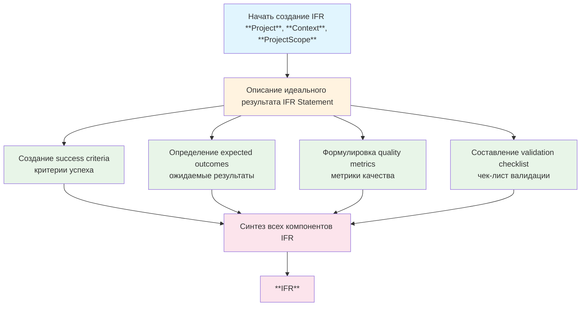

# Методология IFR (Ideal Final Result) в Elephant

## Философия IFR как маяка

IFR (Ideal Final Result) - это маяк, освещающий путь к совершенному результату. Это не компромиссное решение, а идеальная цель, к которой мы стремимся. IFR определяет, каким будет идеальный исход проекта, без оглядки на текущие ограничения и сложности реализации.

## Процесс создания IFR

## Пошаговая инструкция

### Шаг 1: Подготовка к созданию IFR
**Что происходит:** Собираются все необходимые данные для создания идеального результата

**Что делать:**
1. Убедиться, что предыдущий этап **Scope Definition** завершен
2. Проверить наличие **Project**, **Context**, **ProjectScope**
3. Подготовить данные для анализа ИИ

**Результат:** Все входные данные готовы для генерации IFR

---

### Шаг 2: Анализ входных данных
**Что происходит:** ИИ анализирует всю собранную информацию о проекте

**Что анализируется:**
- **Project**: Цели и задачи проекта
- **Context**: Контекст реализации и ограничения
- **ProjectScope**: Границы и измерения скоупа (5W+H)

**Результат:** Полное понимание проекта для создания идеального результата

---

### Шаг 3: Генерация идеального результата
**Что происходит:** Создается основной документ IFR с 5 ключевыми компонентами

**Что создается:**
1. **Ideal Final Result statement**: 5 конкретных предложений, описывающих идеальный исход
2. **Success Criteria**: 10-12 измеримых функциональных требований
3. **Expected Outcomes**: 10-12 конкретных результатов для пользователей
4. **Quality Metrics**: 10-12 точных метрик с числовыми значениями
5. **Validation Checklist**: 10-12 тестовых процедур с критериями

**Результат:** Полный IFR документ готов

---

### Шаг 4: Формулировка Success Criteria
**Что происходит:** Определяются критерии успешного выполнения проекта

**Принципы создания:**
- **Функциональность**: Что система должна делать (не как хорошо)
- **Измеримость**: Каждый критерий должен быть проверяемым
- **Полнота**: 10-12 критериев, покрывающих все аспекты

**Примеры:**
- "Пользователь может зарегистрироваться через email и телефон"
- "Система сохраняет историю операций пользователя"
- "Администратор может управлять правами доступа"

**Результат:** Полный набор success criteria

---

### Шаг 5: Определение Expected Outcomes
**Что происходит:** Описываются конкретные результаты, которые получат пользователи

**Принципы создания:**
- **Пользовательский фокус**: Что получит пользователь от проекта
- **Конкретность**: Прямые ответы на вопрос "Что пользователь получит?"
- **Практичность**: Реальные выгоды и преимущества

**Примеры:**
- "Пользователи получают мгновенные уведомления о важных событиях"
- "Компания сокращает время обработки заказов на 50%"
- "Клиенты могут отслеживать статус своих заявок в реальном времени"

**Результат:** Полный набор expected outcomes

---

### Шаг 6: Формулировка Quality Metrics
**Что происходит:** Определяются количественные показатели качества

**Принципы создания:**
- **Точность**: Конкретные числовые значения с единицами измерения
- **Комплексность**: Метрики по производительности, надежности, безопасности, usability
- **Измеримость**: Возможность объективной проверки

**Примеры:**
- "Время отклика API: менее 200 мс"
- "Доступность системы: 99.9%"
- "Время обучения нового пользователя: менее 10 минут"
- "Точность распознавания: 95%"

**Результат:** Полный набор quality metrics

---

### Шаг 7: Составление Validation Checklist
**Что происходит:** Создается чек-лист для проверки соответствия IFR

**Принципы создания:**
- **Тестируемость**: Каждый пункт должен быть проверяемым
- **Полнота**: 10-12 процедур, покрывающих все аспекты
- **Ясность**: Четкие критерии pass/fail

**Примеры:**
- "Verify user registration works with valid email addresses"
- "Verify password reset functionality sends email within 30 seconds"
- "Verify user data is encrypted at rest using AES-256"

**Результат:** Полный validation checklist

---

### Шаг 8: Синтез и финализация IFR
**Что происходит:** Все компоненты объединяются в единый документ IFR

**Что проверяется:**
- **Целостность**: Все компоненты согласованы между собой
- **Полнота**: Ничего не упущено
- **Четкость**: Все формулировки понятны и конкретны

**Результат:** Готовый **IFR** документ

---

### Шаг 9: Сохранение и переход
**Что происходит:** **IFR** сохраняется и проект переходит к следующему этапу

**Результат:** **IFR** готов для использования в следующих этапах

## Вход и выход

### Входные данные
- **Project**: Структурированное описание проекта
- **Context**: Комплексный контекст реализации
- **ProjectScope**: Полный скоуп проекта со всеми измерениями

### Выходные данные
- **IFR**: Полный документ Ideal Final Result, включающий:
  - `ideal_final_result`: 5 предложений идеального результата
  - `success_criteria`: 10-12 функциональных требований
  - `expected_outcomes`: 10-12 ожидаемых результатов
  - `quality_metrics`: 10-12 метрик качества
  - `validation_checklist`: 10-12 проверочных процедур

## Глоссарий ключевых терминов

| Термин | Описание |
|--------|----------|
| **IFR (Ideal Final Result)** | Идеальный конечный результат проекта без компромиссов |
| **Success Criteria** | Критерии, определяющие успешное выполнение проекта |
| **Expected Outcomes** | Конкретные результаты, которые получат пользователи |
| **Quality Metrics** | Количественные показатели качества системы |
| **Validation Checklist** | Чек-лист для проверки соответствия требованиям |

## Принципы работы

### 🎯 Принцип идеальности
IFR описывает совершенный результат, к которому мы стремимся, без учета текущих ограничений.

### 📏 Принцип конкретности
Каждый элемент IFR должен быть максимально конкретным и измеримым.

### 🔍 Принцип комплексности
IFR охватывает все аспекты: функциональность, качество, валидацию.

### 🎯 Принцип пользовательского фокуса
IFR ориентирован на ценность для пользователей и заинтересованных сторон.

### ✅ Принцип проверяемости
Все элементы IFR должны быть объективно проверяемыми.
