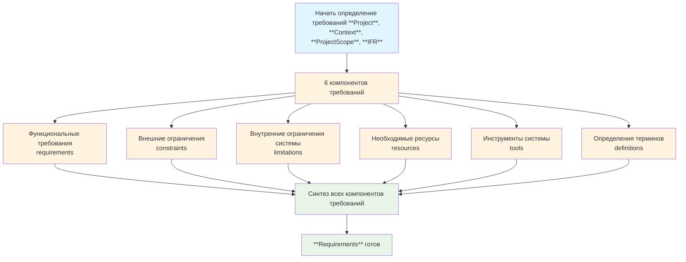

# Методология определения требований (Requirements) в Elephant

## Философия требований как архитектурного плана

Требования - это архитектурный план здания проекта. Они определяют фундамент, несущие конструкции и основные элементы, на которых будет строиться вся система. Требования описывают ЧТО система должна делать, с какими ограничениями сталкиваться, какие ресурсы использовать и какие инструменты применять. Это не просто список пожеланий, а структурированная спецификация, которая служит основой для всех последующих этапов разработки.

## Процесс определения требований

## Пошаговая инструкция

### Шаг 1: Подготовка к определению требований
**Что происходит:** Собираются все необходимые данные из предыдущих этапов для комплексного определения требований

**Что делать:**
1. Проверить, что этап **IFR** завершен и есть **IFR** объект
2. Убедиться в наличии **Project**, **Context**, **ProjectScope**
3. Подготовить данные для анализа: success criteria, expected outcomes, quality metrics, validation checklist
4. Оценить сложность проекта для определения количества требований

**Результат:** Все входные данные готовы для генерации требований

---

### Шаг 2: Параллельная генерация компонентов требований
**Что происходит:** Одновременно определяются все 6 компонентов требований системы

**Что генерируется параллельно:**

**Функциональные требования (requirements):**
- 5-12 конкретных, измеримых функциональных требований
- Фокус на ЧТО система делает, а не КАК
- Формат: "[Компонент]: [выполняет] [конкретную возможность]"

**Внешние ограничения (constraints):**
- 5-12 факторов, ограничивающих реализацию или работу
- Технические, бизнес и ресурсные ограничения
- Формат: "[Ограничение]: [конкретное ограничение системы]"

**Внутренние ограничения системы (limitations):**
- 5-12 границ возможностей и производительности
- Физические, технические и логические ограничения
- Формат: "[Ограничение]: [конкретное ограничение системы]"

**Необходимые ресурсы (resources):**
- 5-12 ресурсов, требуемых системой
- Человеческие, технические, финансовые ресурсы
- Формат: "[Ресурс]: [конкретный ресурс системы]"

**Инструменты системы (tools):**
- 4-12 инструментов, используемых системой
- Только необходимые для работы инструменты
- Формат: "[Инструмент]: [конкретный инструмент для системы]"

**Определения терминов (definitions):**
- 5-12 ключевых определений компонентов
- Термины из описания задачи или необходимые для понимания
- Формат: "[Термин]: [конкретное определение]"

**Что делать:**
1. Инициировать одновременную генерацию всех 6 компонентов
2. Обеспечить комплексность охвата всех аспектов системы
3. Адаптировать количество пунктов под сложностью проекта

**Результат:** Все 6 компонентов требований сгенерированы параллельно

---

### Шаг 3: Синтез и финализация требований
**Что происходит:** Все компоненты требований объединяются в единый структурированный документ

**Что делать:**
1. Проверить полноту каждого компонента требований
2. Убедиться в непротиворечивости между компонентами
3. Проверить соответствие требованиям проекта и IFR
4. Финализировать структуру требований

**Результат:** **Requirements** объект полностью сформирован и готов к использованию

## Вход и выход

### Входные данные
- **Project**: Уточненное описание проекта
- **Context**: Собранный контекст проекта
- **ProjectScope**: Определенные границы проекта
- **IFR**: Идеальный конечный результат с критериями успеха, ожидаемыми результатами, метриками качества и чек-листом валидации

### Выходные данные
- **Requirements**: Структурированный объект с 6 компонентами:
  - `requirements`: Список функциональных требований (5-12 пунктов)
  - `constraints`: Список ограничений (5-12 пунктов)
  - `limitations`: Список ограничений системы (5-12 пунктов)
  - `resources`: Список необходимых ресурсов (5-12 пунктов)
  - `tools`: Список инструментов (4-12 пунктов)
  - `definitions`: Список определений ключевых терминов (5-12 пунктов)

## Глоссарий ключевых терминов

- **Функциональные требования (requirements)**: Конкретные возможности и функции, которые должна выполнять система
- **Внешние ограничения (constraints)**: Факторы извне, ограничивающие реализацию или работу системы (технические, бизнес, ресурсные)
- **Внутренние ограничения системы (limitations)**: Границы возможностей и производительности самой системы (физические, технические, логические)
- **Ресурсы (resources)**: Необходимые для работы системы ресурсы (человеческие, технические, финансовые, временные)
- **Инструменты (tools)**: Программное обеспечение и инструменты, используемые или интегрированные с системой
- **Определения (definitions)**: Глоссарий ключевых терминов и компонентов системы
- **IFR (Ideal Final Result)**: Идеальный конечный результат проекта

## Принципы работы

### Принцип комплексности
Требования должны охватывать все аспекты системы: функциональность, ограничения, ресурсы и инструменты. Неполные требования приводят к проблемам на поздних этапах.

### Принцип конкретности
Каждое требование должно быть конкретным, измеримым и проверяемым. Избегать расплывчатых формулировок типа "система должна быть быстрой".

### Принцип непротиворечивости
Все компоненты требований должны быть согласованы между собой. Противоречия в требованиях приводят к конфликтам реализации.

### Принцип адаптивности
Количество требований должно соответствовать сложности проекта. Для простых проектов достаточно минимального набора, для сложных - детального описания.

### Принцип приоритетов
Требования должны быть упорядочены по важности. Критически важные требования выделены и имеют приоритет в реализации.

### Принцип traceability
Каждое требование должно быть traceable к источнику (IFR, scope, контекст). Это обеспечивает обоснованность каждого пункта.
