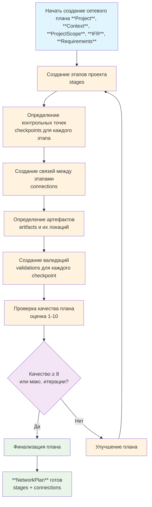

# Методология сетевого плана (Network Plan) в Elephant

## Философия сетевого плана как карты путешествия

Сетевой план - это подробная карта путешествия проекта. Он показывает путь от точки отправления к пункту назначения, отмечая все ключевые этапы (stages), контрольные точки (checkpoints) и связи между ними. Каждый этап - это значимый прогресс в путешествии, а контрольные точки - это ориентиры, подтверждающие, что вы движетесь в правильном направлении. Артефакты служат доказательствами достижения целей, а валидации - проверками качества пути.

## Процесс создания сетевого плана

## Пошаговая инструкция

### Шаг 1: Подготовка к созданию сетевого плана
**Что происходит:** Собираются все необходимые данные из предыдущих этапов для комплексного планирования

**Что делать:**
1. Проверить, что этап **Requirements** завершен
2. Убедиться в наличии **Project**, **Context**, **ProjectScope**, **IFR**, **Requirements**
3. Оценить сложность проекта для определения количества этапов (для небольших проектов 3-5 этапов, для средних 5-7 этапов, для больших 7-10 этапов)
4. Определить ключевые результаты, которые должны быть достигнуты

**Результат:** Все данные готовы для создания плана

---

### Шаг 2: Создание этапов проекта
**Что происходит:** Проект разбивается на основные этапы - значимые milestones

**Что делать:**
1. Определить количество этапов проекта в зависимости от сложности проекта
2. Для каждого этапа написать детальное описание (минимум 200 символов)
3. Определить результаты этапа (минимум 5 пунктов) - что будет достигнуто
4. Указать артефакты для доставки (минимум 5 конкретных deliverables)

**Результат:** Основные этапы и артефакты проекта определены

---

### Шаг 3: Определение контрольных точек
**Что происходит:** Для каждого этапа определяются контрольные точки - ориентиры достижения

**Что делать:**
1. Для каждого этапа определить 3-7 контрольных точек
2. Каждая контрольная точка должна иметь:
   - Четкое описание достижения
   - Артефакт как доказательство (документ, ПО, физический объект)
   - Локацию хранения артефакта (стандартизованное название)
3. Обеспечить, что checkpoints покрывают весь этап

**Результат:** Контрольные точки для всех этапов определены

---

### Шаг 4: Создание связей между этапами
**Что происходит:** Определяются зависимости между этапами

**Что делать:**
1. Проанализировать последовательность выполнения этапов
2. Определить, какие этапы должны быть завершены перед началом других
3. Создать connections: stage1 → stage2 (этап 1 должен быть завершен перед этапом 2)
4. Обеспечить логическую последовательность без циклов
5. Некоторые этапы могут выполняться параллельно, а некоторые должны выполняться последовательно.

**Результат:** Связи между этапами установлены

---

### Шаг 5: Определение артефактов и их локаций
**Что происходит:** Конкретизируются все deliverables проекта

**Что делать:**
1. Для каждого этапа детализировать артефакты в what_should_be_delivered
    - Любая деятельность оставляет след в виде артефакта, это может быть документ, ПО, физический объект и т.д.
    - На этом этапе нужно определить все артефакты, которые будут созданы в ходе проекта и где они будут храниться, их типы и локации, или где они будут находиться.
2. Каждый артефакт должен иметь:
   - Название и описание
   - Тип (документ, ПО, физический объект и т.д.)
   - Конкретную локацию (стандартизованное название)
3. Убедиться, что артефакты тангибельны и измеримы

**Результат:** Все артефакты проекта определены с точными локациями

---

### Шаг 6: Создание валидаций для контрольных точек
**Что происходит:** Определяются проверки качества для каждого достижения

**Что делать:**
1. Для каждой контрольной точки создать минимум 5 валидаций
2. Валидации должны быть:
   - Конкретными и измеримыми
   - Достижимыми и проверяемыми
   - Связанными с реальными критериями качества
3. Обеспечить полноту покрытия всех аспектов достижения

**Результат:** Система проверок качества готова

---

### Шаг 7: Проверка качества плана
**Что происходит:** Оценивается общее качество созданного плана

**Критерии проверки:**
1. **Полнота**: Все этапы покрывают проект полностью
2. **Логичность**: Связи между этапами имеют смысл
3. **Измеримость**: Все достижения можно проверить через валидации
4. **Тангибельность**: Артефакты представляют реальные результаты
5. **Последовательность**: Нет противоречий в зависимостях
6. **Детализация**: Описания достаточно подробны для понимания
7. **Реалистичность**: Этапы достижимы в заданных рамках
8. **Качество**: Общая оценка по шкале 1-10

**Что делать:**
1. Проверить план по всем критериям
2. Выставить общую оценку качества
3. Определить, нужен ли рефакторинг

**Результат:** Оценка качества плана получена

---

### Шаг 8: Улучшение плана (если необходимо)
**Что происходит:** При недостаточном качестве план дорабатывается

**Что делать:**
1. Проанализировать слабые места по итогам проверки
2. Уточнить этапы, контрольные точки или связи
3. Дополнить недостающие валидации или артефакты
4. Повторить процесс до достижения качества ≥8 или максимального числа итераций

**Результат:** План улучшен или готов к финализации

---

### Шаг 9: Финализация сетевого плана
**Что происходит:** План утверждается и готов к дальнейшей декомпозиции

**Что делать:**
1. Провести финальную проверку качества
2. Сохранить план в проектную документацию
3. Подготовить план к следующему этапу - декомпозиции на work packages

**Результат:** **NetworkPlan** полностью сформирован и готов к использованию

## Вход и выход

### Входные данные
- **Project**: Уточненное описание проекта
- **Context**: Собранный контекст проекта
- **ProjectScope**: Определенные границы проекта
- **IFR**: Идеальный конечный результат с критериями успеха, ожидаемыми результатами, метриками качества
- **Requirements**: Полные требования с функциональными требованиями, ограничениями, ресурсами, инструментами, определениями

### Выходные данные
- **NetworkPlan**: Структурированный сетевой план с двумя основными компонентами:
  - `stages`: Список этапов проекта (Stage[])
    - Каждый Stage содержит: id, name, description, result[], what_should_be_delivered[], checkpoints[]
    - Каждый Checkpoint содержит: checkpoint, description, artifact, validations[]
  - `connections`: Связи между этапами (Connection[])
    - Определяют зависимости: stage1 → stage2

## Глоссарий ключевых терминов

- **Сетевой план (Network Plan)**: Структурированное представление проекта как сети связанных этапов и зависимостей
- **Этап (Stage)**: Основной milestone проекта, представляющий значительный прогресс (узел в диаграмме)
- **Контрольная точка (Checkpoint)**: Ориентир достижения цели этапа с артефактами и валидациями
- **Артефакт (Artifact)**: Тангибельный результат этапа (документ, ПО, физический объект) с указанием типа и локации
- **Валидация (Validation)**: Процесс проверки достижения контрольной точки (минимум 5 на checkpoint)
- **Связь (Connection)**: Зависимость между этапами (stage1 должен быть завершен перед stage2)
- **Work Package**: Следующий уровень декомпозиции (этап делится на пакеты работ)
- **Локация (Location)**: Стандартизованное место хранения артефактов (repository, database, file system и т.д.)
- **Deliverable**: Конкретный результат, который должен быть создан в ходе этапа

## Принципы работы

### Принцип итеративного совершенствования
План создается итеративно через последовательные улучшения до достижения требуемого качества (оценка ≥8).

### Принцип тангибельности артефактов
Каждый результат этапа должен быть представлен конкретными артефактами с четко определенными типами и локациями.

### Принцип измеримости валидаций
Каждая валидация должна быть конкретной, измеримой и проверяемой без субъективных интерпретаций.

### Принцип стандартизации локаций
Все артефакты используют фиксированный набор стандартизованных названий локаций для консистентности.

### Принцип комплексной проверки
План проверяется по 8 критериям качества, охватывающим все аспекты структуры и содержания.

### Принцип баланса глубины
Количество этапов и контрольных точек адаптируется под сложность проекта (больше для сложных, меньше для простых).

### Принцип логической последовательности
Связи между этапами должны создавать четкую последовательность зависимостей без циклов и противоречий.

### Принцип traceability
Каждый элемент плана должен быть traceable к требованиям и IFR проекта.
