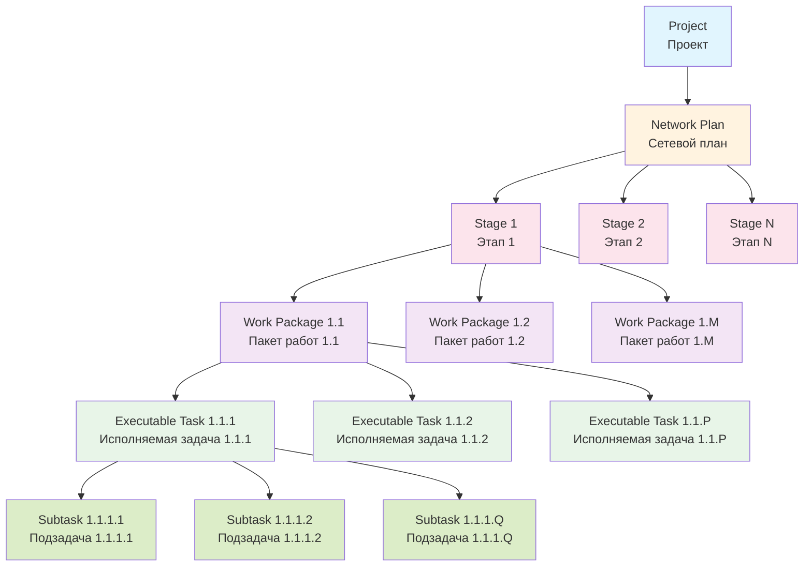
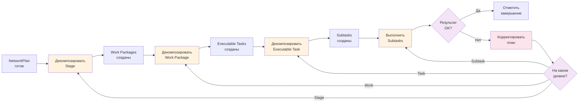

# Методология иерархической декомпозиции (Hierarchical Decomposition) в Elephant

## Философия итеративной декомпозиции

Иерархическая декомпозиция - это процесс разбиения огромного проекта на управляемые кусочки, где каждый уровень становится все более конкретным и исполняемым. Мы начинаем с высокоуровневых этапов и постепенно спускаемся до атомарных действий. Важно, что декомпозиция происходит поэтапно: мы не декомпозируем все сразу, а делаем это шаг за шагом, проверяя и корректируя направление. Проект может измениться в ходе выполнения - появятся новые требования, изменятся приоритеты, откроются подводные камни. Поэтому мы сохраняем гибкость для корректировки плана.

## Процесс иерархической декомпозиции

### Структура иерархии проекта

### Процесс поэтапной декомпозиции

## Пошаговая инструкция

### Шаг 1: Подготовка к декомпозиции
**Что происходит:** Проверяем готовность NetworkPlan и подготавливаемся к поэтапной декомпозиции

**Что делать:**
1. Убедиться, что Network Plan создан и содержит stages
2. Оценить общую сложность проекта и количество этапов
3. Определить приоритеты выполнения этапов (критические пути)
4. Подготовить ресурсы для поэтапного выполнения

**Результат:** Готовность к началу декомпозиции

---

### Шаг 2: Выбор и анализ этапа (Stage)
**Что происходит:** Выбираем следующий этап из NetworkPlan для детальной декомпозиции

**Что делать:**
1. Проанализировать доступные stages в NetworkPlan
2. Оценить зависимости между этапами (connections)
3. Выбрать этап с наивысшим приоритетом или следующий по порядку
4. Изучить описание этапа, его результаты и deliverables
5. Проверить, есть ли уже созданные work packages для этого этапа

**Результат:** Выбран конкретный Stage для декомпозиции

---

### Шаг 3: Декомпозиция Stage на Work Packages
**Что происходит:** Разбиваем выбранный этап на управляемые пакеты работ

**Что генерируется:**
- **Work Packages (3-7 на этап)**: Логические группы работ внутри этапа
  - Каждый Work Package имеет: name, description, sequence_order, dependencies
  - Определяются: required_inputs (нужные артефакты), expected_outcome, generated_artifacts, validation_criteria

**Что делать:**
1. Проанализировать цели и результаты выбранного этапа
2. Определить основные подзадачи внутри этапа
3. Сгруппировать подзадачи в логические Work Packages
4. Определить зависимости между Work Packages внутри этапа
5. Установить критерии проверки для каждого Work Package

**Результат:** Stage разбит на Work Packages

---

### Шаг 4: Выбор и анализ Work Package
**Что происходит:** Выбираем Work Package для дальнейшей декомпозиции на исполняемые задачи

**Что делать:**
1. Оценить статус всех Work Packages в текущем Stage
2. Выбрать незавершенный Work Package с наивысшим приоритетом
3. Изучить его описание, ожидаемый результат и критерии проверки
4. Проверить доступность required_inputs для этого Work Package

**Результат:** Выбран Work Package для декомпозиции

---

### Шаг 5: Декомпозиция Work Package на Executable Tasks
**Что происходит:** Разбиваем Work Package на конкретные исполняемые задачи

**Что генерируется:**
- **Executable Tasks (3-10 на Work Package)**: Конкретные действия для выполнения
  - Каждый Executable Task имеет: name, description, sequence_order, dependencies
  - Определяются: required_inputs, generated_artifacts, validation_criteria
  - Устанавливаются связи с родительскими объектами (work_id, stage_id, task_id)

**Что делать:**
1. Проанализировать expected_outcome Work Package
2. Определить последовательность конкретных действий
3. Создать Executable Tasks с четкими инструкциями
4. Определить зависимости между задачами внутри Work Package
5. Установить критерии успешного выполнения каждой задачи

**Результат:** Work Package разбит на Executable Tasks

---

### Шаг 6: Выбор и анализ Executable Task
**Что происходит:** Выбираем Executable Task для финальной декомпозиции на атомарные действия

**Что делать:**
1. Оценить статус всех Executable Tasks в текущем Work Package
2. Выбрать незавершенную задачу с наивысшим приоритетом
3. Изучить ее описание, входы, выходы и критерии проверки
4. Определить тип исполнителя (AI_AGENT, ROBOT, HUMAN)

**Результат:** Выбрана Executable Task для декомпозиции

---

### Шаг 7: Декомпозиция Executable Task на Subtasks
**Что происходит:** Разбиваем Executable Task на атомарные, неделимые действия

**Что генерируется:**
- **Subtasks (3-7 на Executable Task)**: Атомарные операции
  - Каждый Subtask имеет: name, description, sequence_order
  - Определяется: executor_type (AI_AGENT/ROBOT/HUMAN)
  - Устанавливаются связи с родительскими объектами

**Что делать:**
1. Разбить задачу на минимально возможные шаги
2. Для каждого шага определить тип исполнителя
3. Создать четкие инструкции для каждого субтаска
4. Убедиться в логической последовательности выполнения

**Результат:** Executable Task разбит на Subtasks

---

### Шаг 8: Выполнение Subtasks и контроль результатов
**Что происходит:** Выполняем атомарные действия и контролируем их результаты

**Что делать:**
1. Выполнить subtasks в правильной последовательности
2. Для каждого subtask проверить успешность выполнения
3. Зафиксировать результаты и возможные проблемы
4. Оценить соответствие ожиданиям

**Результат:** Subtasks выполнены с контролем качества

---

### Шаг 9: Корректировка плана при необходимости
**Что происходит:** Анализируем результаты выполнения и корректируем план при обнаружении проблем

**Признаки необходимости корректировки:**
1. Результаты не соответствуют ожиданиям
2. Появились новые требования или ограничения
3. Обнаружены более эффективные подходы
4. Изменились приоритеты или цели проекта

**Что делать:**
1. Проанализировать причины отклонений
2. Обновить декомпозицию на нужном уровне (Stage/Work/Task/Subtask)
3. Пересмотреть зависимости и последовательности
4. Зафиксировать изменения в плане

**Результат:** План скорректирован с учетом новых обстоятельств

---

### Шаг 10: Переход к следующему уровню декомпозиции
**Что происходит:** После завершения текущего уровня переходим к следующему

**Последовательность переходов:**
1. После завершения всех Subtasks → Executable Task завершен
2. После завершения всех Executable Tasks → Work Package завершен
3. После завершения всех Work Packages → Stage завершен
4. После завершения всех Stages → весь проект декомпозирован

**Что делать:**
1. Отметить завершение текущего элемента
2. Выбрать следующий элемент для декомпозиции
3. Проверить зависимости и доступность ресурсов
4. Продолжить процесс декомпозиции

**Результат:** Переход на следующий уровень иерархии

## Вход и выход

### Входные данные
- **NetworkPlan**: Сетевой план с этапами, контрольными точками и зависимостями
- **Project**: Описание проекта с контекстом и требованиями
- **Context**: Собранная информация о проекте
- **ProjectScope + IFR + Requirements**: Определенные границы, цели и требования

### Выходные данные
- **Декомпозированная иерархия**: Полная структура проекта
  - `Stages[]` с вложенными `work_packages[]`
  - `Work_Packages[]` с вложенными `executable_tasks[]` 
  - `Executable_Tasks[]` с вложенными `subtasks[]`
  - `Subtask[]` с определенными типами исполнителей
- **Связи и зависимости**: На всех уровнях иерархии
- **Критерии проверки**: Для каждого уровня декомпозиции
- **Статусы выполнения**: Отслеживание прогресса

## Глоссарий ключевых терминов

- **Иерархическая декомпозиция**: Поэтапное разбиение проекта на уровни детализации от этапов до атомарных действий
- **Stage (Этап)**: Высший уровень в иерархии, основной milestone проекта из NetworkPlan
- **Work Package (Пакет работ)**: Группа логически связанных задач внутри этапа (3-7 на этап)
- **Executable Task (Исполняемая задача)**: Конкретное действие с четкими входами/выходами (3-10 на Work Package)
- **Subtask (Подзадача)**: Атомарное, неделимое действие (3-7 на Executable Task)
- **Executor Type**: Тип исполнителя - AI_AGENT (для логики/анализа), ROBOT (для физических действий), HUMAN (для задач, которые могут выполняться только человеком)
- **Dependencies**: Зависимости между элементами одного уровня (что должно быть выполнено раньше)
- **Sequence Order**: Порядок выполнения элементов внутри родительского объекта
- **Validation Criteria**: Критерии проверки успешного выполнения на каждом уровне

## Принципы работы

### Принцип поэтапной декомпозиции
Декомпозиция происходит постепенно, уровень за уровнем, а не сразу весь проект. Это позволяет вовремя корректировать план.

### Принцип гибкости и адаптивности
План может изменяться в ходе выполнения. Новые требования, проблемы или лучшие решения учитываются своевременно.

### Принцип атомарности действий
Каждый уровень детализируется до уровня, где действия становятся неделимыми и понятными для конкретного исполнителя.

### Принцип traceability
Каждый элемент декомпозиции должен быть traceable к родительским элементам и общим целям проекта.

### Принцип ресурсной эффективности
Декомпозиция адаптируется под доступные ресурсы - не создавать лишнюю детализация, если она не нужна.

### Принцип качества на каждом уровне
Каждый уровень декомпозиции проверяется на полноту, логичность и достижимость перед переходом ниже.

### Принцип параллельности где возможно
Независимые ветви декомпозиции могут выполняться параллельно, ускоряя общий процесс.

### Принцип обратной связи
Результаты выполнения нижних уровней используются для корректировки высших уровней плана.
