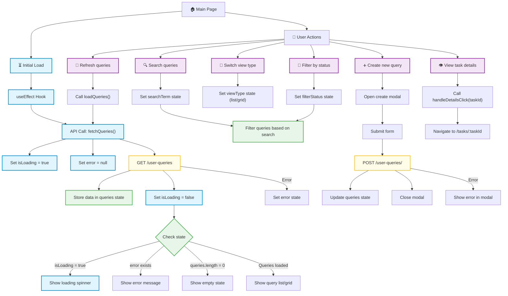

## Диаграмма процессов для главной страницы

### Легенда цветов
- 🔵 **Синий** (loading) - операции загрузки и обработки данных
- 🟣 **Фиолетовый** (userAction) - действия пользователя и взаимодействия с интерфейсом
- 🟡 **Желтый** (apiCall) - вызовы API и сетевые запросы
- 🟢 **Зеленый** (state) - управление состоянием и сохранение данных

