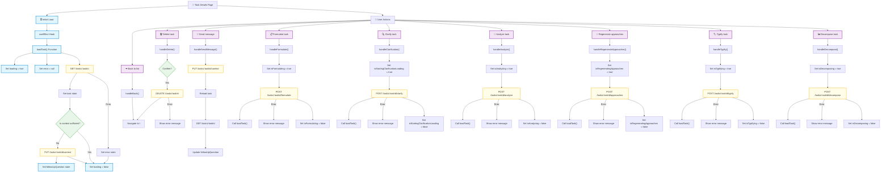

## Диаграмма процессов для страницы деталей задачи

```mermaid
graph TB
    %% Стили для различных элементов
    classDef loading fill:#e1f5fe,stroke:#0288d1,stroke-width:2px
    classDef userAction fill:#f3e5f5,stroke:#8e24aa,stroke-width:2px
    classDef apiCall fill:#fffde7,stroke:#fbc02d,stroke-width:2px
    classDef state fill:#e8f5e9,stroke:#4caf50,stroke-width:2px
    
    %% Основные процессы загрузки
    TaskDetailsPage["📝 Task Details Page"] --> InitialLoadDetails["⏳ Initial Load"]
    InitialLoadDetails --> useEffectDetails["useEffect Hook"] --> loadTask["loadTask() Function"]
    
    loadTask --> setLoadingDetails_True["Set loading = true"]
    loadTask --> setErrorDetails_Null["Set error = null"]
    loadTask --> API_GET_TaskDetails["GET /tasks/:taskId"]
    API_GET_TaskDetails --> setTask["Set task state"]
    API_GET_TaskDetails -- "Error" --> setErrorDetails["Set error state"]
    
    %% Проверка достаточности контекста
    setTask --> CheckContextSufficient{"Is context sufficient?"}
    CheckContextSufficient -- "No" --> API_PUT_Context["PUT /tasks/:taskId/context"]
    API_PUT_Context --> setFollowUpQuestion["Set followUpQuestion state"]
    
    %% Завершение загрузки
    CheckContextSufficient -- "Yes" --> setLoadingDetails_False["Set loading = false"]
    API_PUT_Context --> setLoadingDetails_False
    setErrorDetails --> setLoadingDetails_False
    
    %% Пользовательские действия
    TaskDetailsPage --> TaskUserActions["👤 User Actions"]
    
    %% Возврат назад
    TaskUserActions --> NavigateBack["⬅️ Back to list"]
    NavigateBack --> handleBack["handleBack()"]
    handleBack --> Navigate_MainPage["Navigate to /"]
    
    %% Удаление задачи
    TaskUserActions --> DeleteTask["🗑️ Delete task"]
    DeleteTask --> handleDelete["handleDelete()"]
    handleDelete --> ConfirmDelete{"Confirm?"}
    ConfirmDelete -- "Yes" --> API_DELETE_Task["DELETE /tasks/:taskId"]
    API_DELETE_Task --> Navigate_MainPage
    API_DELETE_Task -- "Error" --> setErrorDelete["Show error message"]
    
    %% Отправка сообщения
    TaskUserActions --> SendMessage["💬 Send message"]
    SendMessage --> handleSendMessage["handleSendMessage()"]
    handleSendMessage --> API_PUT_Context_Message["PUT /tasks/:taskId/context"]
    API_PUT_Context_Message --> ReloadTaskAfterMessage["Reload task"]
    ReloadTaskAfterMessage --> API_GET_TaskDetails_Reload["GET /tasks/:taskId"]
    API_GET_TaskDetails_Reload --> UpdateFollowUpQuestion["Update followUpQuestion"]
    
    %% Формулировка задачи
    TaskUserActions --> FormulateTask["📋 Formulate task"]
    FormulateTask --> handleFormulate["handleFormulate()"]
    handleFormulate --> setIsFormulating_True["Set isFormulating = true"]
    setIsFormulating_True --> API_POST_Formulate["POST /tasks/:taskId/formulate"]
    API_POST_Formulate --> loadTask_Formulate["Call loadTask()"]
    API_POST_Formulate -- "Error" --> setErrorFormulate["Show error message"]
    API_POST_Formulate --> setIsFormulating_False["Set isFormulating = false"]
    
    %% Уточнение задачи
    TaskUserActions --> ClarifyTask["🔍 Clarify task"]
    ClarifyTask --> handleClarification["handleClarification()"]
    handleClarification --> setClarificationLoading["Set isStartingClarificationLoading = true"]
    setClarificationLoading --> API_POST_Clarify["POST /tasks/:taskId/clarify"]
    API_POST_Clarify --> loadTask_Clarify["Call loadTask()"]
    API_POST_Clarify -- "Error" --> setErrorClarify["Show error message"]
    API_POST_Clarify --> setClarificationLoading_False["Set isStartingClarificationLoading = false"]
    
    %% Анализ задачи
    TaskUserActions --> AnalyzeTask["🔬 Analyze task"]
    AnalyzeTask --> handleAnalyze["handleAnalyze()"]
    handleAnalyze --> setIsAnalyzing_True["Set isAnalyzing = true"]
    setIsAnalyzing_True --> API_POST_Analyze["POST /tasks/:taskId/analyze"]
    API_POST_Analyze --> loadTask_Analyze["Call loadTask()"]
    API_POST_Analyze -- "Error" --> setErrorAnalyze["Show error message"]
    API_POST_Analyze --> setIsAnalyzing_False["Set isAnalyzing = false"]
    
    %% Генерация подходов
    TaskUserActions --> RegenerateApproaches["🔄 Regenerate approaches"]
    RegenerateApproaches --> handleRegenerateApproaches["handleRegenerateApproaches()"]
    handleRegenerateApproaches --> setIsRegeneratingApproaches["Set isRegeneratingApproaches = true"]
    setIsRegeneratingApproaches --> API_POST_Approaches["POST /tasks/:taskId/approaches"]
    API_POST_Approaches --> loadTask_Approaches["Call loadTask()"]
    API_POST_Approaches -- "Error" --> setErrorApproaches["Show error message"]
    API_POST_Approaches --> setIsRegeneratingApproaches_False["Set isRegeneratingApproaches = false"]
    
    %% Типизация задачи
    TaskUserActions --> TypifyTask["🏷️ Typify task"]
    TypifyTask --> handleTypify["handleTypify()"]
    handleTypify --> setIsTypifying_True["Set isTypifying = true"]
    setIsTypifying_True --> API_POST_Typify["POST /tasks/:taskId/typify"]
    API_POST_Typify --> loadTask_Typify["Call loadTask()"]
    API_POST_Typify -- "Error" --> setErrorTypify["Show error message"]
    API_POST_Typify --> setIsTypifying_False["Set isTypifying = false"]
    
    %% Декомпозиция задачи
    TaskUserActions --> DecomposeTask["📊 Decompose task"]
    DecomposeTask --> handleDecompose["handleDecompose()"]
    handleDecompose --> setIsDecomposing_True["Set isDecomposing = true"]
    setIsDecomposing_True --> API_POST_Decompose["POST /tasks/:taskId/decompose"]
    API_POST_Decompose --> loadTask_Decompose["Call loadTask()"]
    API_POST_Decompose -- "Error" --> setErrorDecompose["Show error message"]
    API_POST_Decompose --> setIsDecomposing_False["Set isDecomposing = false"]
    
    %% Стилизация элементов
    class InitialLoadDetails,useEffectDetails,loadTask,setLoadingDetails_True,setLoadingDetails_False,setErrorDetails_Null,setFollowUpQuestion loading
    class NavigateBack,DeleteTask,SendMessage,FormulateTask,ClarifyTask,AnalyzeTask,RegenerateApproaches,TypifyTask,DecomposeTask userAction
    class API_GET_TaskDetails,API_PUT_Context,API_DELETE_Task,API_PUT_Context_Message,API_POST_Formulate,API_POST_Clarify,API_POST_Analyze,API_POST_Approaches,API_POST_Typify,API_POST_Decompose apiCall
    class CheckContextSufficient,ConfirmDelete state
``` 