# Elephant Assistant Agent Architecture

## System Overview Mermaid Diagram

```mermaid
graph TB
    %% User Interface Layer
    User[👤 User] --> Frontend[🖥️ React Frontend<br/>- Task Management UI<br/>- Network Graph Viz<br/>- Chat Interface]
    
    %% API Gateway
    Frontend --> API[🚀 FastAPI Backend<br/>- RESTful API<br/>- WebSocket Streaming<br/>- CORS Middleware]
    
    %% Core Router System
    API --> Router[🧠 Router Agent<br/>- Intent Analysis<br/>- Agent Selection<br/>- Session Management]
    
    %% Specialized Agent Pool
    Router --> ChatAgent[💬 General Chat Agent<br/>- Conversational AI<br/>- Simple queries<br/>- Clarifications]
    
    Router --> DataAgent[📊 Data Analysis Agent<br/>- CSV/Excel processing<br/>- Statistical analysis<br/>- Visualizations]
    
    Router --> CodeAgent[⚙️ Code Development Agent<br/>- Programming tasks<br/>- Debugging<br/>- Script execution]
    
    Router --> ResearchAgent[🔍 Research Agent<br/>- Web search<br/>- Information gathering<br/>- Fact verification]
    
    Router --> PlanningAgent[📋 Planning Agent<br/>- Strategic planning<br/>- Project roadmaps<br/>- Workflow design]
    
    Router --> ExecutorAgent[⚡ Executor Agent<br/>- Task orchestration<br/>- Multi-step execution<br/>- Progress tracking]
    
    %% Agent Tools & Capabilities
    subgraph "Agent Toolset"
        FileTools[📁 Filesystem Tools<br/>- Workspace-scoped<br/>- File operations<br/>- Directory management]
        
        WebTools[🌐 Web Tools<br/>- Search capabilities<br/>- Information retrieval<br/>- Source validation]
        
        CognitiveTools[🧩 Cognitive Tools<br/>- Analysis functions<br/>- Decision making<br/>- Problem solving]
        
        TaskTools[📋 Task Management Tools<br/>- Task generation<br/>- Progress tracking<br/>- Status updates]
        
        DatabaseTools[🗄️ Database Tools<br/>- Task persistence<br/>- State management<br/>- Query execution]
    end
    
    %% Workspace Management
    subgraph "Persistent Workspace"
        WorkspaceManager[📂 Workspace Manager<br/>- Per-task isolation<br/>- Context preservation<br/>- File organization]
        
        TaskWorkspace[📁 Task Workspace<br/>- data/<br/>- output/<br/>- scripts/<br/>- reports/]
        
        ContextStore[💾 Context Store<br/>- Session history<br/>- Project notes<br/>- Generated artifacts]
    end
    
    %% Database Layer
    subgraph "Data Persistence"
        SQLite[(🗃️ SQLite Database)]
        TaskTable[📋 Tasks Table]
        QueryTable[❓ User Queries Table]
        StateTable[📊 Task States]
        
        SQLite --> TaskTable
        SQLite --> QueryTable
        SQLite --> StateTable
    end
    
    %% Agent Monitoring
    subgraph "Monitoring & Tracking"
        AgentTracker[📈 Agent Tracker<br/>- Activity logging<br/>- Performance metrics<br/>- Tool usage analytics]
        
        SessionService[🔐 Session Service<br/>- Session management<br/>- State preservation<br/>- Memory service]
    end
    
    %% Task Processing Pipeline
    subgraph "Task Pipeline Stages"
        ContextGathering[1️⃣ Context Gathering<br/>- Requirement clarification<br/>- Interactive Q&A<br/>- Context validation]
        
        ScopeFormulation[2️⃣ Scope Formulation<br/>- 5W+H framework<br/>- Boundary definition<br/>- Objective clarity]
        
        IFRGeneration[3️⃣ IFR Generation<br/>- Success criteria<br/>- Quality metrics<br/>- Validation checklist]
        
        RequirementsDefinition[4️⃣ Requirements Definition<br/>- Technical specs<br/>- Constraints<br/>- Resource needs]
        
        NetworkPlanning[5️⃣ Network Planning<br/>- Stage definition<br/>- Dependencies<br/>- Checkpoints]
        
        TaskDecomposition[6️⃣ Task Decomposition<br/>- Hierarchical breakdown<br/>- Stage → Work → Task → Subtask<br/>- Executor assignment]
    end
    
    %% Data Flow Connections
    ChatAgent --> FileTools
    DataAgent --> FileTools
    CodeAgent --> FileTools
    ResearchAgent --> WebTools
    PlanningAgent --> CognitiveTools
    ExecutorAgent --> TaskTools
    
    Router --> AgentTracker
    Router --> SessionService
    
    API --> SQLite
    WorkspaceManager --> TaskWorkspace
    WorkspaceManager --> ContextStore
    
    %% Pipeline Flow
    ContextGathering --> ScopeFormulation
    ScopeFormulation --> IFRGeneration
    IFRGeneration --> RequirementsDefinition
    RequirementsDefinition --> NetworkPlanning
    NetworkPlanning --> TaskDecomposition
    
    %% External Integrations
    subgraph "External Services"
        OpenAI[🤖 OpenAI GPT Models<br/>- GPT-4<br/>- LiteLLM abstraction]
        GoogleADK[🔧 Google ADK<br/>- Agent framework<br/>- Tool integration<br/>- Model management]
    end
    
    Router --> GoogleADK
    GoogleADK --> OpenAI
    
    %% Styling
    classDef userLayer fill:#e1f5fe
    classDef apiLayer fill:#f3e5f5
    classDef agentLayer fill:#e8f5e8
    classDef toolLayer fill:#fff3e0
    classDef dataLayer fill:#fce4ec
    classDef pipelineLayer fill:#f1f8e9
    
    class User,Frontend userLayer
    class API apiLayer
    class Router,ChatAgent,DataAgent,CodeAgent,ResearchAgent,PlanningAgent,ExecutorAgent agentLayer
    class FileTools,WebTools,CognitiveTools,TaskTools,DatabaseTools toolLayer
    class SQLite,TaskTable,QueryTable,StateTable,WorkspaceManager,TaskWorkspace,ContextStore dataLayer
    class ContextGathering,ScopeFormulation,IFRGeneration,RequirementsDefinition,NetworkPlanning,TaskDecomposition pipelineLayer
```

## Agent Workflow Decision Tree

```mermaid
flowchart TD
    Start([👤 User Request]) --> Analyze{🧠 Intent Analysis}
    
    Analyze -->|"Data keywords<br/>(analyze, csv, plot)"| DataRoute[📊 Route to Data Agent]
    Analyze -->|"Code keywords<br/>(program, debug, script)"| CodeRoute[⚙️ Route to Code Agent]
    Analyze -->|"Research keywords<br/>(search, investigate)"| ResearchRoute[🔍 Route to Research Agent]
    Analyze -->|"Planning keywords<br/>(plan, strategy, roadmap)"| PlanningRoute[📋 Route to Planning Agent]
    Analyze -->|"Low confidence<br/>or general query"| ChatRoute[💬 Route to Chat Agent]
    
    DataRoute --> DataExecution[📊 Data Analysis<br/>- CSV processing<br/>- Statistical analysis<br/>- Visualization creation]
    
    CodeRoute --> CodeExecution[⚙️ Code Development<br/>- Script writing<br/>- Code execution<br/>- Debugging assistance]
    
    ResearchRoute --> ResearchExecution[🔍 Research Tasks<br/>- Web searching<br/>- Information synthesis<br/>- Source validation]
    
    PlanningRoute --> PlanningExecution[📋 Planning Tasks<br/>- Strategic planning<br/>- Task breakdown<br/>- Timeline creation]
    
    ChatRoute --> ChatExecution[💬 General Assistance<br/>- Conversational help<br/>- Simple queries<br/>- Clarifications]
    
    DataExecution --> Complex{🤔 Complex Task?}
    CodeExecution --> Complex
    ResearchExecution --> Complex
    PlanningExecution --> Complex
    ChatExecution --> Complex
    
    Complex -->|Yes| Pipeline[📋 Enter Task Pipeline<br/>1. Context Gathering<br/>2. Scope Formulation<br/>3. IFR Generation<br/>4. Requirements<br/>5. Network Planning<br/>6. Task Decomposition]
    
    Complex -->|No| DirectExecution[⚡ Direct Execution<br/>- Use agent tools<br/>- Generate response<br/>- Update workspace]
    
    Pipeline --> Execution[⚡ Execute Decomposed Tasks<br/>- Subtask execution<br/>- Progress tracking<br/>- Result aggregation]
    
    DirectExecution --> Result[✅ Deliver Results]
    Execution --> Result
    
    Result --> WorkspaceUpdate[📂 Update Workspace<br/>- Save artifacts<br/>- Update context<br/>- Log activities]
    
    WorkspaceUpdate --> End([✨ Task Complete])
    
    %% Styling
    classDef startEnd fill:#e1f5fe,stroke:#01579b,stroke-width:2px
    classDef decision fill:#fff3e0,stroke:#e65100,stroke-width:2px
    classDef agent fill:#e8f5e8,stroke:#2e7d32,stroke-width:2px
    classDef process fill:#f3e5f5,stroke:#7b1fa2,stroke-width:2px
    classDef result fill:#fce4ec,stroke:#c2185b,stroke-width:2px
    
    class Start,End startEnd
    class Analyze,Complex decision
    class DataRoute,CodeRoute,ResearchRoute,PlanningRoute,ChatRoute agent
    class DataExecution,CodeExecution,ResearchExecution,PlanningExecution,ChatExecution,DirectExecution,Pipeline,Execution process
    class Result,WorkspaceUpdate result
```

## Agent Communication Pattern

```mermaid
sequenceDiagram
    participant U as 👤 User
    participant F as 🖥️ Frontend
    participant A as 🚀 API
    participant R as 🧠 Router Agent
    participant S as 🤖 Specialist Agent
    participant T as 📈 Agent Tracker
    participant W as 📂 Workspace
    participant D as 🗄️ Database
    
    U->>F: Submit request
    F->>A: POST /tasks/{id}/chat
    A->>R: Analyze intent
    R->>T: Log activity start
    
    alt Intent Analysis
        R->>R: Keyword matching
        R->>R: Confidence scoring
        R->>R: Agent selection
    end
    
    R->>S: Route to specialist
    S->>T: Log agent handoff
    
    loop Tool Execution
        S->>W: Access workspace tools
        W->>S: Return results
        S->>T: Log tool usage
        
        alt Database Operation
            S->>D: Query/Update data
            D->>S: Return results
        end
        
        alt Web Research
            S->>S: Execute web tools
            S->>S: Process results
        end
    end
    
    S->>W: Save artifacts
    S->>D: Update task state
    S->>T: Log completion
    S->>A: Stream response
    A->>F: WebSocket stream
    F->>U: Display results
    
    Note over T: All activities tracked<br/>for debugging and analytics
```

## Key Features & Capabilities

### 🎯 **Intelligent Routing**
- **Intent Analysis**: Keyword-based scoring system
- **Confidence Thresholds**: Fallback to general chat for low confidence
- **Multi-Agent Collaboration**: Agents can delegate to each other

### 🔧 **Comprehensive Toolset**
- **Workspace-Scoped File Operations**: Isolated per task
- **Web Research Capabilities**: Real-time information gathering
- **Database Integration**: Task persistence and state management
- **Cognitive Tools**: Analysis and decision-making functions

### 📂 **Persistent Workspace**
- **Per-Task Isolation**: Each task gets its own workspace
- **Session Continuity**: Work persists across sessions
- **Context Preservation**: Project notes and history maintained
- **Artifact Management**: Generated files organized systematically

### 📊 **Structured Task Pipeline**
- **6-Stage Methodology**: From context gathering to execution
- **Hierarchical Decomposition**: Stage → Work → Task → Subtask
- **Progress Tracking**: Real-time status updates
- **Quality Assurance**: Validation at each stage

### 🔍 **Monitoring & Analytics**
- **Agent Activity Tracking**: All actions logged
- **Performance Metrics**: Tool usage and execution times
- **Session Management**: State preservation and history
- **Debug Capabilities**: Comprehensive trace information

This architecture enables the Elephant system to handle complex, multi-step tasks while maintaining context, ensuring quality, and providing transparency throughout the entire process. 